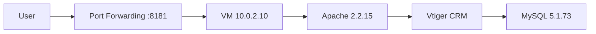
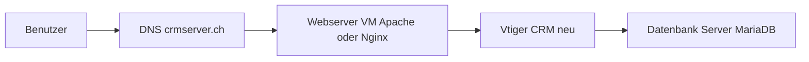
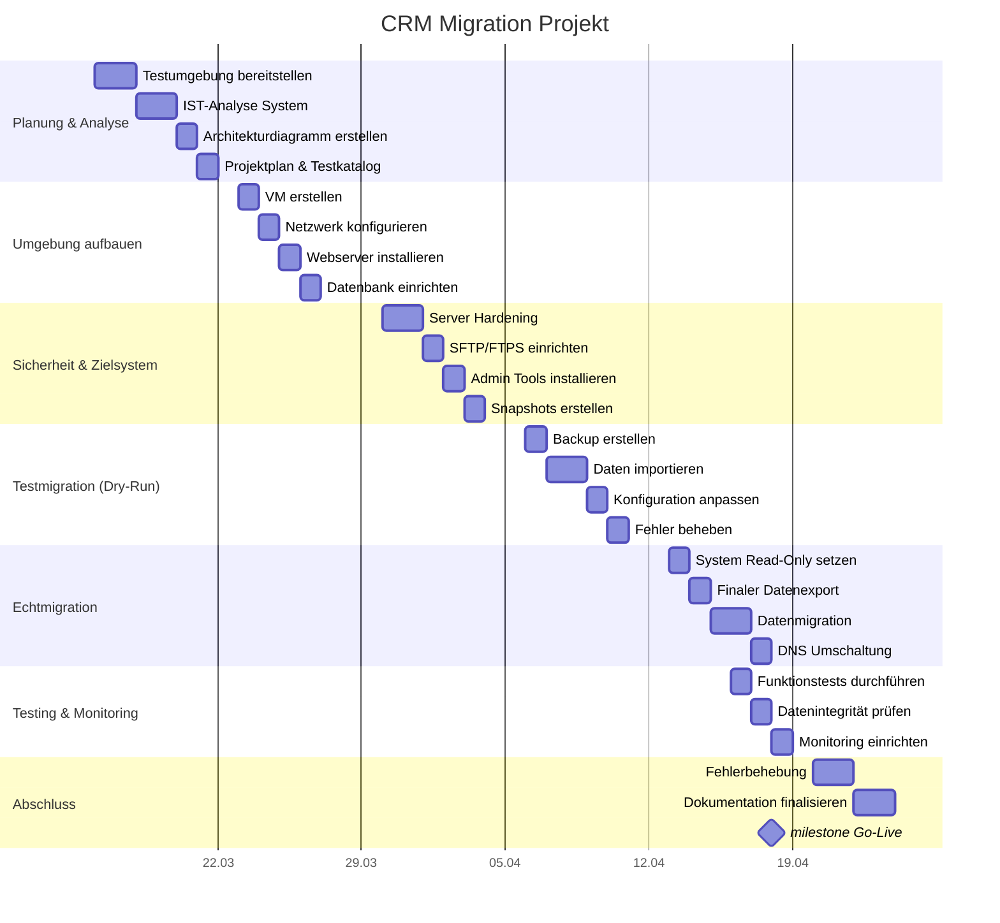

# Phase 1: Projektplan & IST-Analyse – CRM Migration

## 1. Ausgangslage und Projektziele
Das bestehende CRM-System wird aktuell als lokale virtuelle Maschine (on-premise) betrieben. Im Rahmen dieses Projekts erfolgt eine umfassende Modernisierung. Der Auftrag umfasst die vollständige Migration auf ein neues Betriebssystem (OS) mit einem neuen Web- und Datenbank-Server. Dabei muss zwingend sichergestellt werden, dass die Datenmigration komplett und verlustfrei abläuft und das Sicherheitsniveau der gesamten Infrastruktur spürbar erhöht wird.

Der erste Schritt besteht in der Projektvorbereitung: Das bestehende System wird anhand eines Exports in einer isolierten Testumgebung bereitgestellt. Anschliessend wird eine detaillierte IST-Analyse durchgeführt.

---

## 2. IST-Systemanalyse

### 2.1 Systemübersicht
Das bestehende CRM-System basiert auf einer monolithischen Architektur.

- System: Virtuelle Maschine (on-premise)
- Zugriff: SSH via Port Forwarding
- Applikation: Vtiger CRM
- Installationspfad: `/var/www/html/vtigercrm/`

---

### 2.2 Webserver

- Software: Apache HTTP Server  
- Version: 2.2.15  
- Build: 2014  

Bewertung:
- End-of-Life
- keine Sicherheitsupdates

---

### 2.3 Datenbank

- Software: MySQL  
- Version: 5.1.73  
- Port: 3306  
- Datenbank: `vtigercrm`  

Analyse:
- Anzahl Tabellen: 491
- Zentrale Tabellen:
  - vtiger_users
  - vtiger_account
  - vtiger_contactdetails
  - vtiger_leaddetails
  - vtiger_troubletickets
  - vtiger_crmentity

Bewertung:
- stark veraltet
- Sicherheitsrisiko

---

### 2.4 Netzwerk

- IP: 10.0.2.10 (NAT)
- Zugriff:
  - http://localhost:8181
  - SSH: localhost:2222

Bewertung:
- nicht produktionsfähig
- nur Testumgebung

---

### 2.5 Sicherheitsbewertung

Das System weist folgende Schwächen auf:

- Veraltete Software (Apache + MySQL)
- Keine Updates
- Monolithische Architektur
- Schwache Zugangsdaten
- Keine Trennung von Komponenten

---

### 2.6 Schlussfolgerung

Das System ist technisch veraltet und stellt ein Sicherheitsrisiko dar. Eine Migration ist zwingend notwendig.

Um diese Problematiken nachhaltig zu beheben, die IT-Sicherheit zu erhöhen und von neuen Funktionen zu profitieren, hat man sich für ein **vTiger Upgrade** entschieden.

---

## 3. Architekturdiagramm (IST-Zustand)

---
## 4. SOLL-Architektur (modern)

---

## 5. Vergleich IST vs SOLL

| Bereich | IST | SOLL |
|--------|-----|------|
| Architektur | Monolithisch | Getrennt |
| Webserver | Apache 2.2 | Apache 2.4 / Nginx |
| Datenbank | MySQL 5.1 | MariaDB aktuell |
| Sicherheit | schlecht | hoch |
| Netzwerk | NAT | DNS |
| Wartbarkeit | schwierig | gut |
| Skalierbarkeit | keine | vorhanden |

---

## 6. Evaluation der Migrationsvarianten

### Variante A: Vtiger Upgrade
**Vorteile:**
- Geringes Risiko
- Keine Schulung

**Nachteile:**
- Kompatibilitätsprobleme möglich

---

### Variante B: Neues ERP (Odoo)
**Vorteile:**
- Modern
- Optimierbar

**Nachteile:**
- Sehr hoher Aufwand
- Schulung notwendig

---
### 6.1 Begründung der gewählten Migrationsvariante (Variante A)

Im Rahmen der Evaluation wurde entschieden, die bestehende Vtiger-Installation auf eine aktuelle Version zu migrieren, anstatt einen vollständigen Systemwechsel durchzuführen.

Diese Entscheidung basiert auf mehreren technischen und organisatorischen Faktoren:

#### 6.2 Minimierung des Projektrisikos
Da die bestehende Datenbankstruktur von Vtiger beibehalten wird, ist das Risiko eines Datenverlusts deutlich geringer. Ein vollständiger Systemwechsel würde ein komplexes Data Mapping erfordern, bei dem Datenstrukturen transformiert werden müssen. Dies erhöht die Wahrscheinlichkeit von Inkonsistenzen und Datenverlust erheblich.

#### 6.3 Hohe Systemverfügbarkeit
Das CRM-System wird an 5–6 Tagen pro Woche aktiv genutzt. Ein Wechsel auf ein komplett neues System würde eine längere Downtime verursachen, da:
- Daten migriert und transformiert werden müssen
- das neue System umfangreich getestet werden muss
- Schulungen durchgeführt werden müssen

Durch das Upgrade innerhalb desselben Systems kann die Migration effizienter durchgeführt und die Ausfallzeit auf ein Minimum reduziert werden.

#### 6.4 Reduzierter Schulungsaufwand
Die Mitarbeitenden sind bereits mit der bestehenden Benutzeroberfläche und den Prozessen vertraut. Ein Systemwechsel würde eine vollständige Einarbeitung erfordern, was:
- Zeit kostet
- Produktivität reduziert
- zusätzliche Kosten verursacht

Durch die Beibehaltung von Vtiger bleibt die Benutzerführung weitgehend gleich.

#### 6.5 Geringere Komplexität der Migration
Ein Upgrade innerhalb desselben Systems ist technisch weniger komplex als eine Migration auf ein anderes ERP-System. Es sind keine:
- Datenmodell-Transformationen
- Schnittstellen-Anpassungen
- Prozess-Neudefinitionen

notwendig.

#### 6.6 Kosten-Nutzen-Verhältnis
Die Kosten für Variante B (Systemwechsel) sind deutlich höher aufgrund:
- zusätzlicher Entwicklungsarbeit (Data Mapping)
- Schulungsaufwand
- längerer Projektlaufzeit
---

### Schlussfolgerung

Aufgrund der geringeren Risiken, der kürzeren Ausfallzeit, der geringeren Kosten sowie der besseren Planbarkeit wird Variante A (Upgrade von Vtiger) als optimale Lösung gewählt.

Ein vollständiger Systemwechsel (Variante B) wäre zwar technologisch moderner, ist jedoch im aktuellen Kontext wirtschaftlich und organisatorisch nicht sinnvoll.

---

## 7. Ressourcenplanung

| Phase | Aufwand | Kosten |
|------|--------|-------|
| Planung | 4h | CHF 480 |
| Setup | 8h | CHF 960 |
| Sicherheit | 6h | CHF 720 |
| Testmigration | 10h | CHF 1200 |
| Echtmigration | 6h | CHF 720 |
| Abschluss | 4h | CHF 480 |
| **Total** | **38h** | **CHF 4560** |

---

## 8. Analyse der Webapplikation (CRM)

Im Rahmen der IST-Analyse wurde die CRM-Applikation direkt über den Webbrowser untersucht.

Der Zugriff erfolgte über:
http://127.0.0.1:8181/vtigercrm/

Nach Anpassung der Administrator-Zugangsdaten in der Datenbank konnte ein erfolgreicher Login durchgeführt werden.

### Beobachtungen

- Das Dashboard (Startseite) wird korrekt geladen
- Die Navigation enthält zentrale CRM-Module:
  - Kalender
  - Leads
  - Organisationen (Firmen)
  - Personen (Kontakte)
  - Verkaufschancen
  - Produkte
  - Tickets
- Es sind bereits reale Datensätze vorhanden (z. B. Aktivitäten von Benutzern)
- Statistiken und Diagramme werden angezeigt
- Neue Einträge können erstellt werden (funktionale Grundfähigkeit gegeben)

### Technische Bewertung

Die Applikation ist grundsätzlich funktionsfähig, weist jedoch mehrere Schwächen auf:

- Veraltete Benutzeroberfläche
- Teilweise fehlerhafte Requests („Illegal request“)
- Abhängigkeit von sehr alten Softwareversionen (Apache 2.2, MySQL 5.1)
- Unsichere Passwortverwaltung (Reset über Datenbank möglich)

### Schlussfolgerung

- Das CRM-System ist aktuell noch betriebsfähig, jedoch technisch veraltet und nur eingeschränkt stabil. Die Analyse bestätigt, dass eine Migration notwendig ist, um Sicherheit, Stabilität und Zukunftsfähigkeit zu gewährleisten.

### Beispiel Bilder wie das System momentan aussieht:

---

## 9. Gantt Diagram

